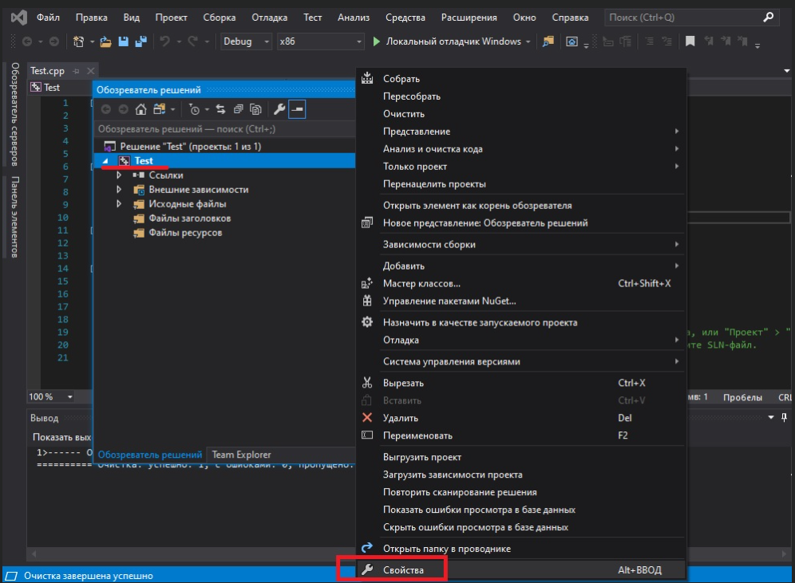
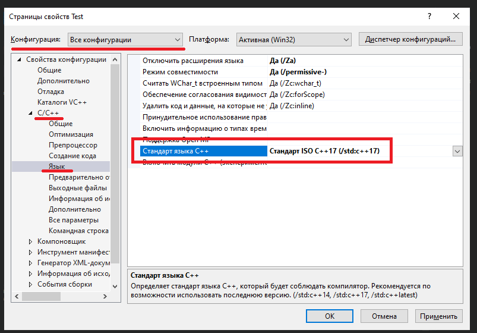

# Урок №10. Налаштування компілятора: Вибір стандарту мови С++

Як із величезної кількості різних версій C++ (C++98, C++03, C++11, C++14, C++17, C++20) компілятор розуміє, яку з них йому слід використовувати? Як правило, компілятор вибирає стандарт мови програмування за замовчуванням (дуже часто це не є найновішою версією мови). Якщо ви хочете використовувати інший стандарт, то вам необхідно буде внести певні зміни в налаштування вашої IDE/компілятора. Варто зазначити, що дані налаштування застосовуються лише до поточного проекту. При створенні нового проекту вам доведеться все робити заново.

Зміст:

- Кодові імена версій мови С++
- Вибір стандарту мови С++ в Visual Studio
- Тестування вашого компілятора

# Кодові імена версій мови С++

Зверніть увагу, що стандарти мови С++ названі в честь тих років, в які вони були завершені/опубліковані (наприклад, C++17 був завершений та опублікований в 2017 році).

Однак, коли узгоджується новий стандарт мови програмування, то дуже часто буває незрозуміло, в якому році вдасться його завершити, тому поточному стандарту мови, який розробляється, дають кодове ім’я, яке потім замінюється на фактичну назву версії при публікуванні. Наприклад, C++11 мав кодове ім’я c++1x, коли над ним вели роботу. Ви і досі можете натикатися на подібні кодові імена версій С++, особливо, коли мова заходить про майбутню версію мови С++, у якої ще немає остаточної назви.

Нижче подані кодові імена версій С++ і їх остаточні назви:

c++1x = C++11

c++1y = C++14

c++1z = C++17

c++2a = C++20

Наприклад, якщо ви зустріли назву c++1z, то знайте, що це є синонімом стандарту мови C++17.

### Вибір стандарту мови С++ в Visual Studio

На момент написання даної статті, Visual Studio 2019 за замовчуванням використовує функціонал версії C++14, що не дозволяє використовувати нові можливості, представлені в C++17 (і в C++20).

Щоб використовувати новий функціонал, вам необхідно підключити новий стандарт мови. На жаль, зараз немає способу зробити це глобально — ви повинні робити це для кожного проекту окремо.

Щоб використовувати новий стандарт мови С++ в Visual Studio, відкрийте ваш проект, клацніть правою кнопкою миші по назві вашого проекту в "Оглядач рішень" > "Властивості":



В діалоговому вікні вашого проекту переконайтеся, що в пункті "Конфигурація" вибрано значення "Всі конфигурациї". Після цього перейдіть на вкладку "C/C++" > "Мова" і в пункті "Стандарт мови С++" виберіть ту версію С++, яку ви хотіли б використовувати:



На момент написання даної статті, я рекомендую вибрати "Стандарт ISO C++17 (/std:c++17)", який є найновішим стабільним стандартом, який підтримує Visual Studio.

Якщо ви хочете поекспериментувати з можливостями майбутнього стандарту мови C++20, то ви можете вибрати пункт "Попередня версія ... (/std:c++latest)". Просто пам’ятайте, що його підтримка може мати баги.

### Тестування вашого компілятора

Після того, як ви підключили версію C++17 або вище, ви можете провести тест, чи дійсно ви підключили нову версію. Наступна програма в С++17 повинна виконатися без будь-яких попереджень чи помилок:

```cpp
#include <array>
#include <iostream>
#include <string_view>
#include <tuple>
#include <type_traits>

namespace a::b::c
{
    inline constexpr std::string_view str{ "hello" };
}

template <class... T>
std::tuple<std::size_t, std::common_type_t<T...>> sum(T... args)
{
    return { sizeof...(T), (args + ...) };
}

int main()
{
    auto [iNumbers, iSum]{ sum(1, 2, 3) };
    std::cout << a::b::c::str << ' ' << iNumbers << ' ' << iSum << '\n';

    std::array arr{ 1, 2, 3 };

    std::cout << std::size(arr) << '\n';

    return 0;
}
```

Якщо вам не вдалося скомпілювати цей код, то або ви не підключили C++17, або ваш компілятор не повністю підтримує C++17. В останньому випадку просто оновіть версію вашої IDE/компілятора.
