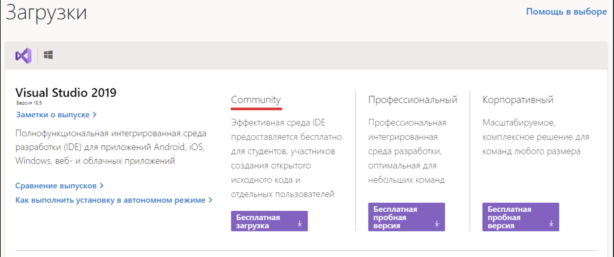
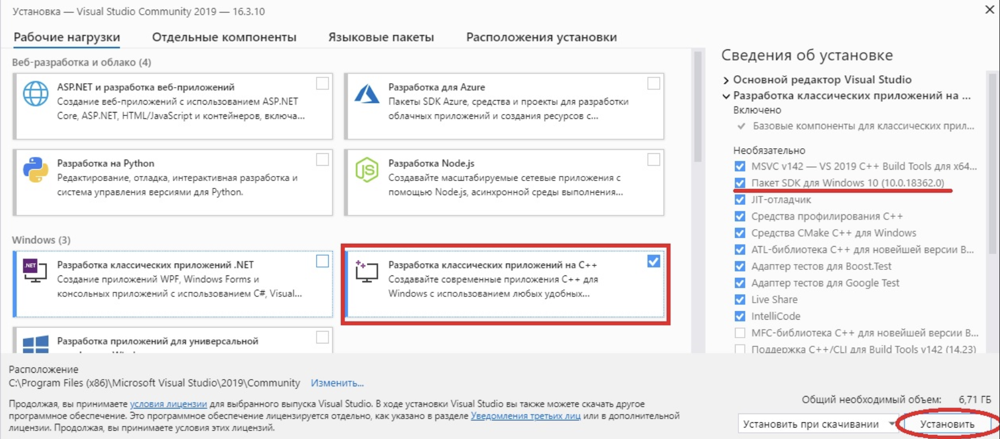
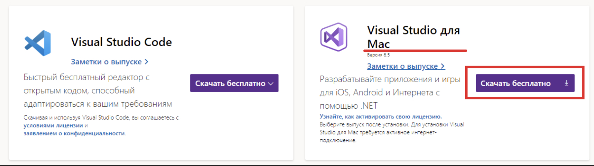

# Урок №4. Встановлення IDE (Інтегрованого Середовища Розробки)

Інтегроване середовище розробки (скор. “IDE” від англ. “Integrated Development Environment”) — це програмне забезпечення, яке містить все необхідне для розробки, компіляції, лінкінгу та відлагодження коду програм. Нам необхідно встановити одну з таких IDE для написання програм на мові С++.

Але яке саме інтегроване середовище розробки вибрати? Я рекомендую Visual Studio від Microsoft (для користувачів Windows) або Code::Blocks (для користувачів Linux/Windows). Також ви можете встановити і будь-яку іншу IDE. Основні концепції, які розглядатимуться на даних уроках, працюватимуть у всіх середовищах розробки. Втім, іноді код може частково відрізнятися в різних IDE, тому вам доведеться самостійно шукати більш детальну інформацію про специфіку роботи в обраній вами IDE.

Зміст:

- IDE для користувачів Windows
- IDE для користувачів Linux/Windows
- IDE для користувачів macOS
- Веб-компілятори

### IDE для користувачів Windows

Якщо ви користувач Windows, то можете встановити Visual Studio 2019 версію “Community”, яка є безкоштовною (всі інші версії платні):

Після того, як ви скачаєте і запустите інсталятор, вам потрібно буде вибрати пункт "Разработка классических приложений на C++". Пункти, вибрані за замовчуванням в правій частині екрана, не варто чіпати — там все добре, тільки переконайтеся, що поставлена галочка біля пункту "Пакет SDK для Windows 10". Цей пакет може використовуватися і в більш ранніх версіях Windows, тому не переживайте, якщо у вас Windows 7 або Windows 8 — все працюватиме. Після цього натискаємо "Встановити":

При бажанні ви можете вказати галочки і біля інших пунктів для скачування, але врахуйте, що тоді розмір завантажуваного вами середовища розробки буде збільшено.

IDE для користувачів macOS
Користувачі техніки Apple можуть використовувати Xcode або Eclipse. Eclipse за замовчуванням не налаштований на використання C++, тому вам потрібно буде додатково встановити компоненти для C++.

Або ви можете встановити Visual Studio для Mac:

### Веб-компілятори

Веб-компілятори підходять для написання простих та невеликих програм. Їх функціонал обмежений: ви не зможете зберігати проекти, створювати виконувані файли або ефективно проводити відлагодження програм, тому краще скачати повноцінну IDE, якщо ви дійсно серйозно налаштовані. Веб-компілятори більше підійдуть для швидкого запуску невеликих програм.

Популярні веб-компілятори:

- OnlineGDB

- TutorialsPoint

- C++ Shell

- Repl.it

Тепер, коли ви вже встановили середовище для розробки, прийшла пора написати нашу першу програму в С++!
