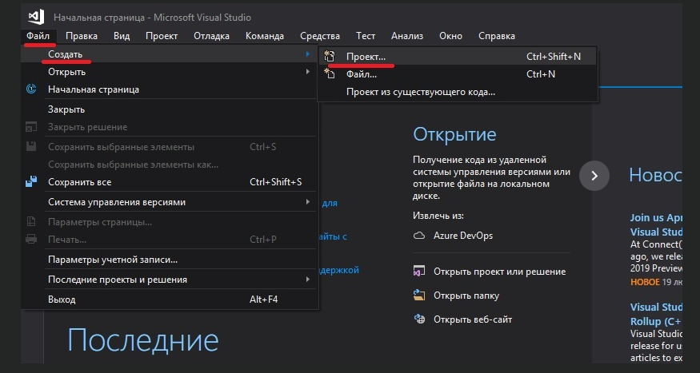
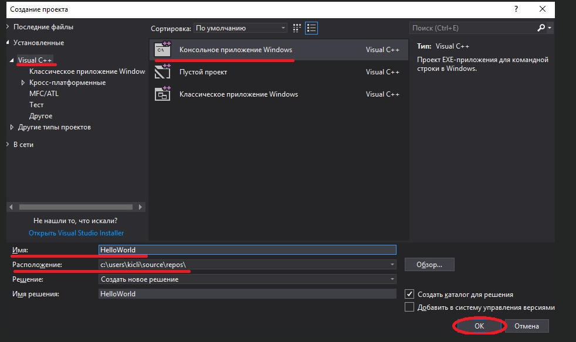
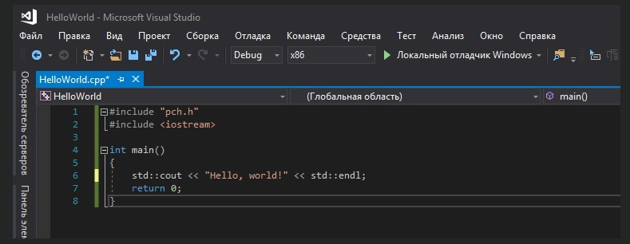
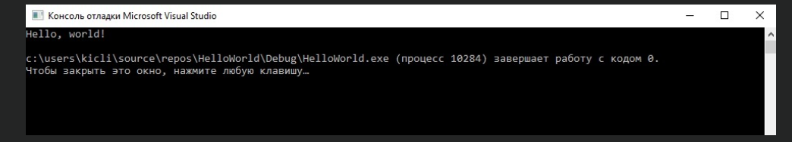
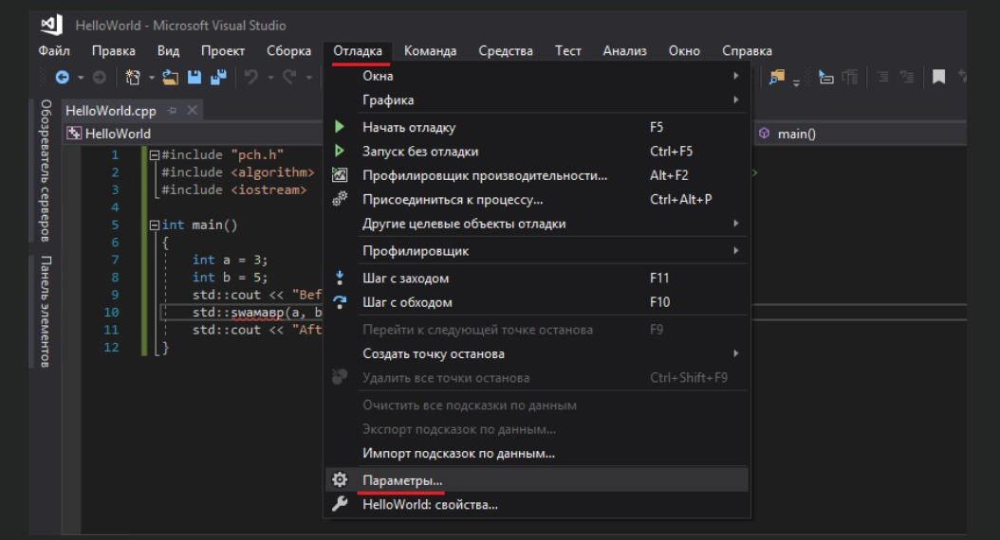
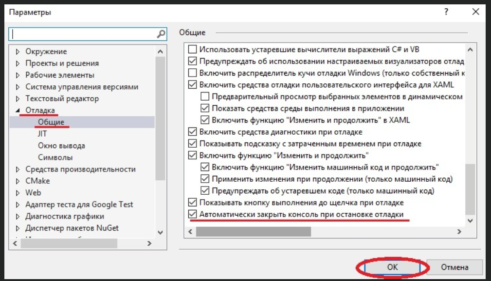
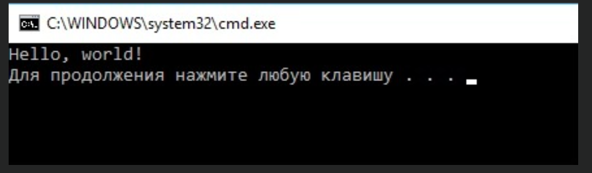

# Урок №5. Компіляція вашої першої програми

### Перед написанням нашої першої програми ми повинні ще дещо дізнатися.

---

Зміст:

- Теорія

- Користувачам Visual Studio

- Якщо компіляція пройшла невдало

---

## Теорія

По-перше, незважаючи на те, що код наших програм знаходиться в .cpp-файлах, ці файли додаються в проект. Проект містить всі необхідні файли вашої програми, а також зберігає вказані вами налаштування вашої IDE. Кожен раз, при відкритті вашого проекту, він запускається з того моменту, на якому ви зупинилися минулого разу. При компіляції програми, проект повідомляє компілятору і лінкеру, які файли необхідно скомпілювати, а які зв’язати. Варто відзначити, що файли проекту однієї IDE не працюватимуть в іншій IDE. Вам доведеться створювати новий проект (в іншій IDE).

По-друге, є різні типи проектів. При створенні нового проекту, вам потрібно буде вибрати його тип. Всі проекти, які ми створюватимемо на даних уроках, будуть консольного типу. Це означає, що вони запускаються в консолі (аналог командного рядка). За замовчуванням, консольні додатки не мають графічного інтерфейсу користувача (скор. “GUI” від англ. “Graphical User Interface”) і компілюються в автономні виконувані файли. Це ідеальний варіант для вивчення C++, оскільки він зводить всю складність до мінімуму.

По-третє, при створенні нового проекту більшість середовищ розробки автоматично додадуть ваш проект в робочий простір. Робочий простір — це своєрідний контейнер, який може містити один або декілька пов’язаних проектів. Незважаючи на те, що ви можете додавати декілька проектів в один робочий простір, все ж рекомендується створювати окремий робочий простір для кожної програми. Це набагато простіше для початківців.

Традиційно, нашою першою програмою на мові С++ буде всім відома програма «Hello, world!». Ми не будемо порушувати традиції 🙂

## Користувачам Visual Studio

Для створення нового проекту в Visual Studio, вам необхідно спочатку запустити Visual Studio, а потім вибрати "Файл" > "Створити" > "Проект":



Далі з’явиться діалогове вікно, де вам потрібно буде вибрати "Консольное приложение Windows" на вкладці "Visual C++" і натиснути"ОК":



Також ви можете вказати ім’я проекту (будь-яке) і його місцезнаходження (рекомендую нічого не змінювати) в відповідних полях.

В текстовому редакторі ви побачите, що в вашому робочому просторі вже є написаний текст з кодом. Видаліть все, що там написано і напишіть наступний код:

```c++
#include <iostream>

int main()
{
	std::cout << "Hello, world!" << std::endl;
	return 0;
}
```

Ось, що у вас повинно бути:



`ВАЖЛИВЕ ЗАУВАЖЕННЯ: Рядок #include "pch.h" потрібен тільки для користувачів Visual Studio 2017. Якщо у вас Visual Studio 2019 або програма видає вам помилку, що цей файл не знайдений і т.д., і при цьому у вас все відмінно працює без цього рядка, то не потрібно взагалі писати цей рядок.`

Щоб запустити програму в Visual Studio, натисніть `Ctrl+F5` . У вас повинно вийти наступне:



Це означає, що компіляція виконалася успішно і результат виконання вашої програми:

`Hello, world!`

Щоб видалити рядок `...завершает работу с кодом 0...`, вам необхідно перейти в "Налагодження" > "Параметри":



Потім "Налагодження" > "Загальні" і поставити галочку біля "Автоматически закрыть консоль при остановке отладки" і натиснути "ОК":



Тепер ваше консольне вікно виглядатиме наступним чином:



## Якщо компіляція пройшла невдало

Дихайте, без паніки. Скоріш за все, це якась дрібниця. Алгоритм наступний:

По-перше, переконайтеся, що ви написали/скопіювали код правильно, без помилок. Текст помилки від компілятора може дати вам ключ для розуміння і вирішення вашої проблеми.

По-друге, дивіться Урок №6 — там є вирішення найбільш поширених проблем початківців в С++.

Якщо нічого з вищевказаного не допомогло — просто “загугліть” проблему. З ймовірністю в 90% хтось вже стикався з подібною проблемою і знайшов її рішення.

`Висновки
Вітаю! Ви написали, скомпілювали і запустили свою першу програму в C++! Не турбуйтеся, якщо ви не розумієте, що означає весь вищенаведений код. Ми все детально розглянемо на наступних уроках.`

---
