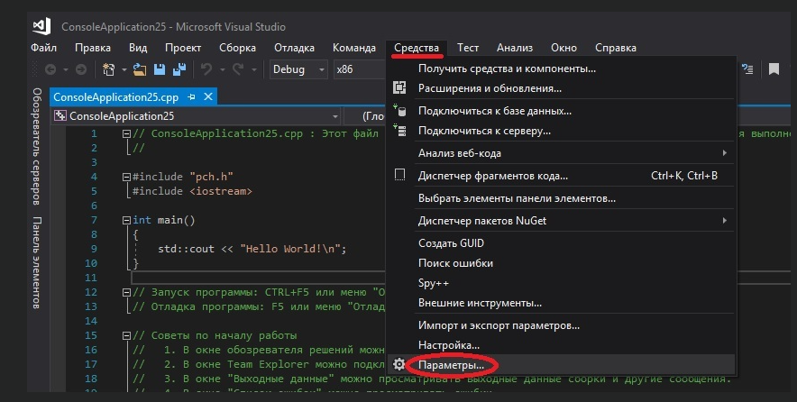
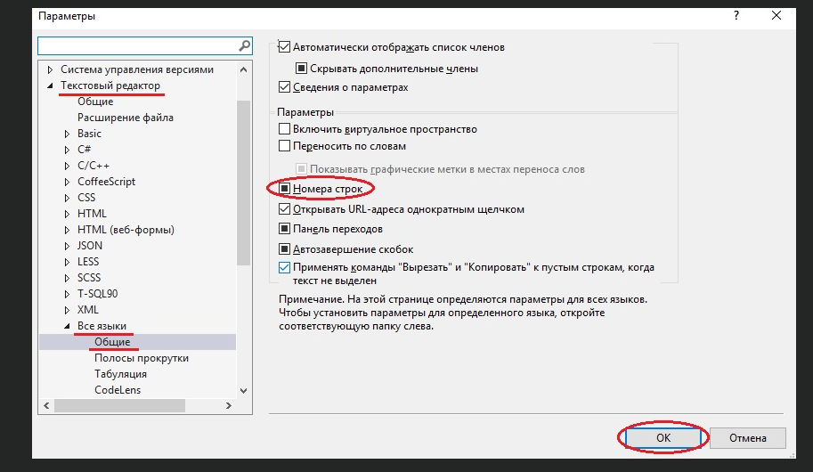

# Урок №6. Вирішення найбільш поширених проблем початківців в С++

На цьому уроці ми розглянемо найбільш поширені проблеми, з якими стикаються початківці в C++.

Зміст:

- Проблема №1

- Проблема №2

- Проблема №3

- Проблема №4

- Проблема №5

- Проблема №6

- Проблема №7

- Проблема №8

- Проблема №9

- Проблема №10

- В мене інша проблема

### Проблема №1

`Як використовувати кирилицю в програмах С++?`

Рішення №1

Щоб використовувати кирилицю в програмах на мові C++, вам необхідно підключити заголовковий файл Windows.h:

```cpp
#include <Windows.h>
```

І прописати два наступних рядки в функції main():

```cpp
SetConsoleCP(1251);
SetConsoleOutputCP(1251);
```

### Проблема №2

`При запуску програми з’являється чорне консольне вікно, а потім відразу зникає.`

Рішення №2

Деякі компілятори (наприклад, Bloodshed’s Dev C++) автоматично не затримують консольне вікно після того, як програма завершила своє виконання. Якщо проблема в компіляторі, то наступні два кроки допоможуть вам вирішити цю проблему:

Крок №1: Додайте наступний рядок коду в верхню частину вашої програми:

```cpp
#include <iostream>
```

Крок №2: Додайте наступний код в кінець функції main() (перед оператором return):

```cpp
std::cin.clear();
std::cin.ignore(32767, '\n');
std::cin.get();
```

Таким чином ваша програма очікуватиме натискання клавіші, щоб закрити консольне вікно. Ви отримаєте додатковий час, щоб добре все роздивитися/вивчити. Після натискання будь-якої клавіші, консольне вікно закриється.

Інші рішення, такі як system("pause");, можуть працювати не на всіх типах операційних систем, тому краще використовувати вищезазначений варіант.

`Примітка: Visual Studio не затримує консольне вікно, якщо виконання програми запущено з відлагодженням ("Отладка" > "Начать отладку" або F5). Якщо ви хочете, щоб була пауза, то скористайтеся вищезазначеним рішенням, або запустіть програму без відлагодження ("Отладка" > "Запуск без отладки" або Ctrl+F5).`

### Проблема №3

`При використанні cin, cout або endl компілятор повідомляє, що cin, cout або endl є “undeclared identifier” (неоголошеними ідентифікаторами).`

Рішення №3

По-перше, переконайтеся, що в самому початку вашої програми є наступний рядок коду:

```cpp
#include <iostream>
```

По-друге, переконайтеся, що cin, cout або endl мають префікс std::. Наприклад:

```cpp
std::cout << "Hello world!" << std::endl;
```

### Проблема №4

`При використанні endl для переходу на новий рядок з’являється помилка, що end1 є “undeclared identifier”.`

Рішення №4

Переконайтеся, що ви не сплутали букву l (нижній регістр L) в endl з цифрою 1. В endl всі символи є літерами. Також дуже легко можна сплутати велику літеру О з цифрою 0 (нуль).

### Проблема №5

`Моя програма компілюється, але виконується не так, як потрібно. Що робити?`

Рішення №5

Виконайте відлагодження вашої програми. Детально про це читайте на уроці №29 і на уроці №30.

### Проблема №6

`Як включити нумерацію рядків в Visual Studio?`

Рішення №6

Перейдіть в "Засоби" > "Параметри":



Після цього відкрийте вкладку "Текстовий редактор" > "Всі мови" > "Спільні" і відмітьте пункт "Номера строчок", і натисніть "ОК":



### Проблема №7

`При компіляції програми я отримую наступну помилку: “unresolved external symbol _main or _WinMain@16”.`

Рішення №7

Це означає, що ваш компілятор не може знайти головну функцію main(). Всі програми повинні мати цю функцію.

Тут є декілька пунктів, які потрібно перевірити:

Чи є у вашій програмі функція main()?

Чи правильно написано слово main?

Чи підключений файл, який має функцію main(), до вашого проекту? (якщо ні, то перемістіть функцію main() в файл, який є частиною вашого проекту, або додайте цей файл в ваш проект)

Чи підключений файл, який має функцію main(), до компіляції?

### Проблема №8

`При компіляції програми я отримую наступне попередження: “Cannot find or open the PDB file”.`

Рішення №8

Це не помилка, а лише попередження, яке на роботу вашої програми ніяк не вплине. Тим не менше, в Visual Studio ви можете вирішити це наступним чином: перейдіть в меню "Отладка" > "Параметры" > "Отладка" > "Символы" і поставте галочку біля "Серверы символов (Майкрософт)", і натисніть "ОК".

### Проблема №9

`Я використовую Code::Blocks або g++ в яких не підключений (не працює) функціонал C++11/C++14.`

В Code::Blocks перейдіть в "Project" > "Build options" > "Compiler settings" > "Compiler flags" і поставте галочку біля пункта "Have g++ follow C++14 ISO C++ language standard". Дивіться урок №4, там є скріншоти, як це зробити.

При компіляції в g++, додайте наступний код в командний рядок:

-std=c++14

### Проблема №10

`Я запустив програму, з’явилося консольне вікно, але нічого не виводиться на екран.`

Рішення №10

Ваш антивірус може блокувати виконання вашої програми. Спробуйте відключити його і запустіть програму ще раз.

### В мене інша проблема, з якою я не можу самостійно впоратися. Де і як я можу отримати її рішення?

Протягом вивчення даних уроків у вас, безсумнівно, з’являтимуться питання (на які ви можете не знайти відразу відповіді) або ви стикатиметеся з проблемами. Що робити в таких випадках?

По-перше, загугліть вашу проблему. Якщо у вас є текст помилки, то скопіюйте його і вставте в пошук Google, використовуючи лапки. Швидше за все, у когось вже була така помилка, як у вас, і він знайшов її рішення.

Якщо Google не допоміг, то ви можете спитати в інших користувачів на спеціалізованих сервісах питань-відповідей або на форумах. Ось найпопулярніші з них:

Stack Overflow

CyberForum

Хабр Q&A (колишній Toster)

Але будьте уважні і намагайтеся максимально чітко сформулювати свою проблему. Вкажіть, яку операційну систему і IDE ви використовуєте, а також те, що ви вже спробували зробити самостійно.
