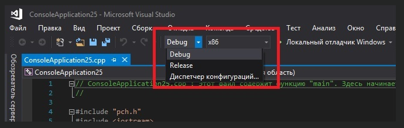

# Урок №7. Налаштування компілятора: Режими конфігурації “Debug” і “Release”

Конфігурація збірки (англ. “build configuration”) — це набір налаштувань проекту, які визначають принцип його побудови. Конфігурація збірки складається з:

імені виконуваного файлу;

директорії виконуваного файлу;

в яких директоріях IDE шукатиме код та заголовкові файли;

інформації про відлагодження та параметри оптимізації вашого проекту.

Ваше інтегроване середовище розробки має дві конфігурації збірки: “Debug” (Дебаг/Відлагодження) і “Release” (Реліз).

Конфігурація “Debug” призначена для відлагодження вашої програми. Ця конфігурація відключає всі налаштування по оптимізації та включає інформацію про відлагодження, що робить ваші програми більшими і повільнішими, але спрощує проведення відлагодження. Режим “Debug” зазвичай використовується в якості конфігурації збірки за замовчуванням.

Конфігурація “Release” використовується для побудови програми з метою її подальшого публікування. Програма оптимізується за розміром і продуктивністю і не містить додаткової інформації про відлагодження.

Наприклад, виконуваний файл програми “Hello, World!” з уроку №5, створений в конфігурації “Debug”, у мене займав 65 КБ, в той час як виконуваний файл, побудований в конфігурації “Release”, займав всього лише 12 КБ.

Перемикання режимів “Debug” і “Release” в Visual Studio
Найпростіший спосіб змінити конфігурацію проекту — це вибрати відповідну конфігурацію зі списку на панелі швидкого доступу:

Висновки
Використовуйте конфігурацію “Debug” при розробці програм, а конфігурацію “Release” при їх публікації (коли ви вже будете готові представити вашу програму на загальний огляд).
