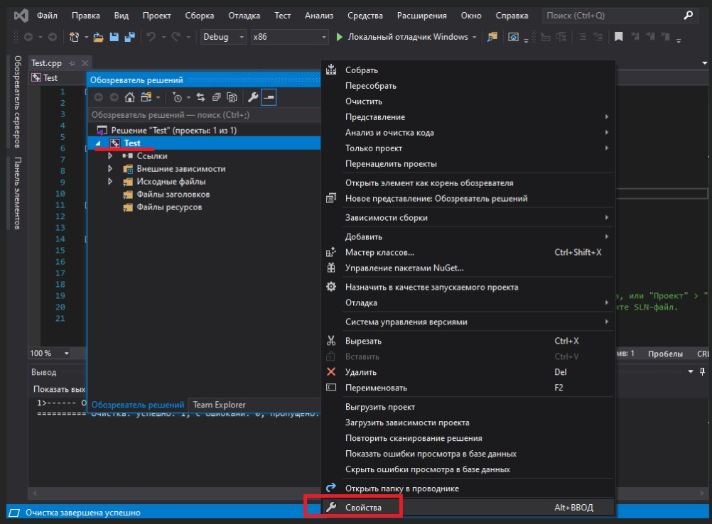
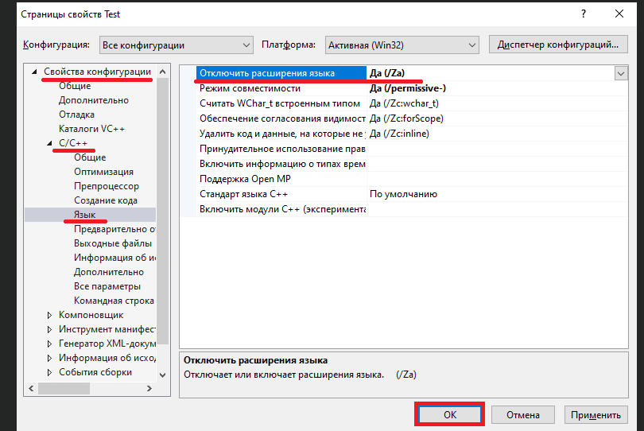

# Урок №8: Налаштування компілятора: Розширення компілятора

На цьому уроці ми розглянемо, що таке розширення компілятора, чи є вони корисними і як їх вимкнути.

Зміст:

- Розширення компілятора
- Вимкнення розширень компілятора
- Користувачам Visual Studio

### Розширення компілятора

Стандарт C++ визначає правила щодо того, як програми повинні себе поводити в конкретних ситуаціях. І в більшості випадків компілятори також дотримуються цих правил. Однак багато компіляторів впроваджують власні зміни в мову програмування, часто для підвищення сумісності з іншими версіями мови (наприклад, C99). Ці поведінкові зміни, які є різними в різних компіляторах, називаються розширеннями компілятора.

Використовуючи розширення компілятора ви отримуєте можливість написання програм, які є несумісними зі стандартом C++. Програми, які використовують нестандартні розширення, зазвичай, не компілюватимуться в інших компіляторах (які не підтримують ці ж розширення), або працюватимуть некоректно.

Дуже часто розширення компілятора є включеними за замовчуванням. Особливо це стосується початківців, коли вони можуть вважати поведінку, специфічну для певного компілятора, як частину офіційного стандарту C++ (коли насправді це не так).

Оскільки розширення компілятора рідко коли потрібні і можуть зробити ваші програми невідповідними стандарту C++, то я раджу вимикати розширення компілятора.

`Порада: Вимикайте розширення компілятора, щоб бути певними, що ваші програми залишаються сумісними зі стандартом C++ і працюватимуть у будь-якій системі.`

`Примітка: Ці налаштування застосовуються до кожного проекту окремо. Вам потрібно буде це все повторювати для кожного новоствореного вами проекту, або створити шаблон проекту з цими налаштуваннями і тоді вже по ньому створювати нові проекти.`

### Вимкнення розширень компілятора

Користувачам Visual Studio

Щоб вимкнути розширення компілятора в Visual Studio, клацніть правою кнопкою миші по назві вашого проекту в "оглядач рішень" > "ВлаСТИВОСТІ":

У діалоговому вікні проекту переконайтесь, що в полі "Конфигурация" вибрано пункт "Все конфигурации". Потім перейдіть на вкладку "C/C++" > "Мова" та встановіть значення "Да (/Za)" для пункту "Відключити розширення мови", після цього натисніть "OK":

