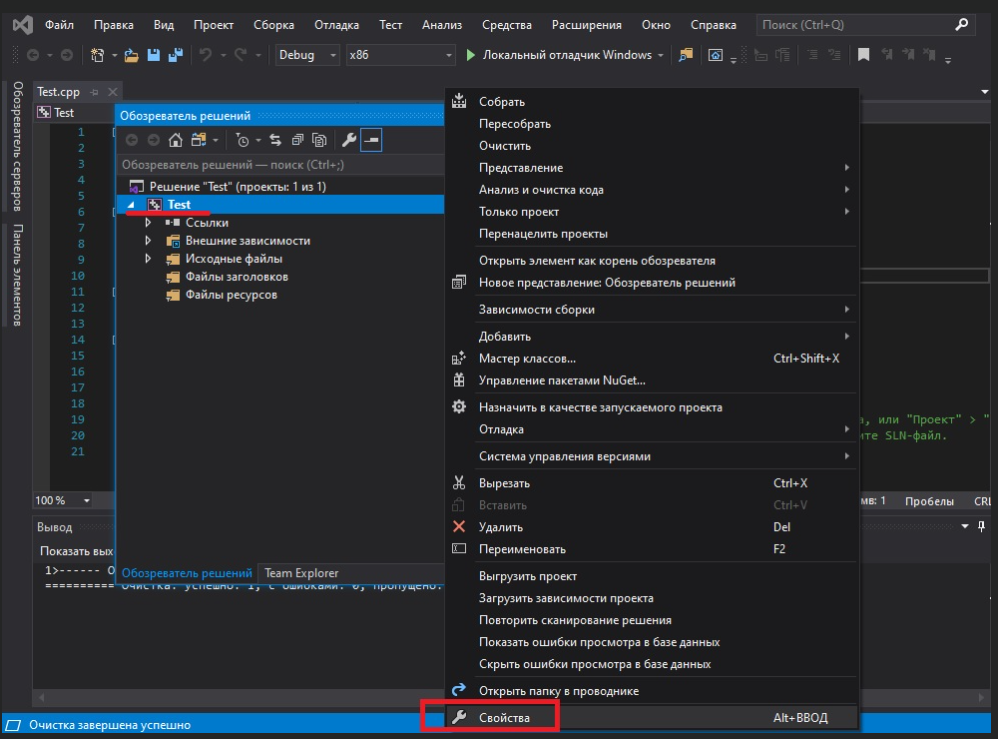
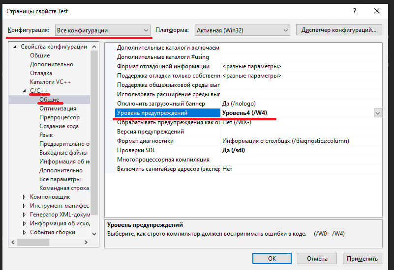
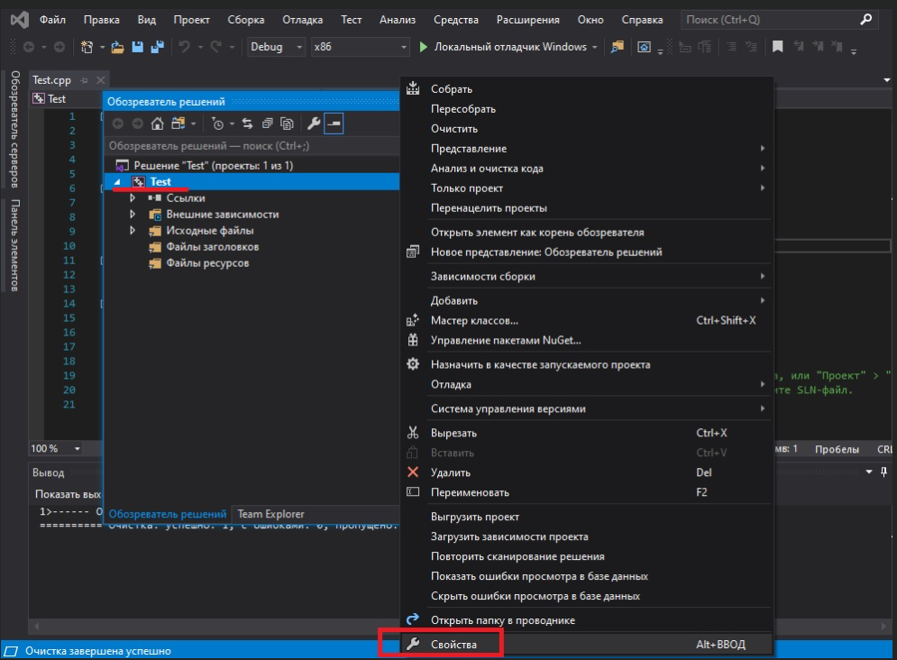
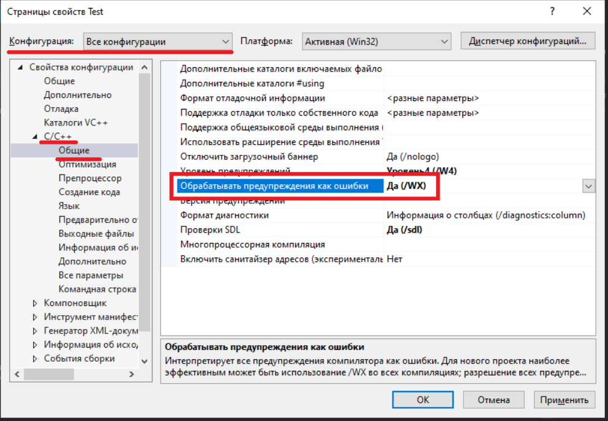

# Урок №9. Налаштування компілятора: Попередження та помилки

Сьогодні ми поговоримо про те, як підвищити рівень попереджень в компіляторах і змусити компілятор сприймати всі попередження так, наче це помилки.

Зміст:

- Попередження в С++
- Зміна рівня попереджень
- Обробка попереджень як помилок

### Попередження в С++

На етапі компіляції компілятор перевіряє, чи відповідає ваш код правилам мови програмування C++. Якщо ви порушили синтаксис С++, то компілятор видасть вам помилку, надавши як номер рядка, який містить помилку, так і зміст самої помилки. Фактично, помилка може перебувати як в рядку, про який вам повідомив компілятор, так і в рядку перед ним. Після того, як ви визначили і виправили рядки коду з помилками, ви можете спробувати скомпілювати вашу програму ще раз.

Також трапляються ситуації, коли компілятор бачить код з помилками, але не до кінця в цьому впевнений (пам’ятайте, що суть філософії С++ полягає у виразі «Довіряй програмісту!»). У таких випадках компілятор може видати вам попередження. Попередження не зупиняють процес компіляції, але повідомляють програмісту, що щось пішло не так.

`Порада: Не дозволяйте попередженням накопичуватися. Вирішуйте їх по мірі надходження (наче це помилки).`

У більшості випадків попередження можуть бути усунені шляхом виправлення помилки, на яку вказує попередження, або шляхом переписування рядків коду, які генерують попередження, таким чином, щоб ці попередження більше не генерувалися.

Дуже рідко може знадобитися варіант явно вказати компілятору, щоб він не генерував конкретне попередження для поточного рядка коду. C++ не підтримує такий спосіб вирішення попереджень, але деякі компілятори (включаючи Visual Studio і GCC) надають можливість (через директиви #pragma) тимчасового вимкнення попереджень.

За замовчуванням більшість компіляторів генерують лише попередження про найбільш очевидні проблеми. Однак ви можете попросити ваш компілятор бути більш доскіпливим у генерації попереджень, повідомляючи про всі речі, які він вважає дивними.

`Порада: Змініть рівень попереджень компілятора на вищий, особливо під час навчання. Це допоможе вам у визначенні та вирішенні можливих проблем.`

### Зміна рівня попереджень

Щоб підвищити рівень попереджень в Visual Studio, клацніть правою кнопкою миші по назві вашого проекту в "Оглядач рішень" > "Властивості":

В діалоговому вікні вашого проекту переконайтесь, що в пункті "Конфігурація" вибрано значення "Всі конфигурації". Після цього перейдіть на вкладку "C/C++" > "Загальні" і в пункті "Ріень попереджень" виберіть значення "Рівень4 (/W4)":

Після цього натисніть на "Застосувати" і "ОК".

`Примітка: Не вибирайте пункт "Включить все предупреждения (/Wall)", інакше ви будете “поховані” в попередженнях, які генеруються Стандартною бібліотекою C++.`

### Обробка попереджень як помилок

Ви також можете вказати вашому компілятору сприймати всі попередження, як помилки (в такому випадку компілятор зупинятиме процес компіляції, якщо знайде будь-які попередження). Це хороший варіант змусити себе виправляти всі попередження, особливо, якщо вам не вистачає самодисципліни (як і більшості із нас).

Щоб обробляти всі попередження як помилки, натисніть правою кнопкою миші по назві вашого проекту в "Оглядач рішень" > "Властивості":

В діалоговому вікні вашого проекту переконайтеся, що в полі "Конфигурація" вибрано значення "Всі конфигурації". Після цього перейдіть на вкладку "C/C++" > "Загальні" і в пункті "Обробляти ПОПЕРЕДЖЕННЯ як помилки" виберіть значення "Так(/WX)":

Після цього натисніть на "Застосувати" і "ОК".
